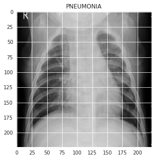
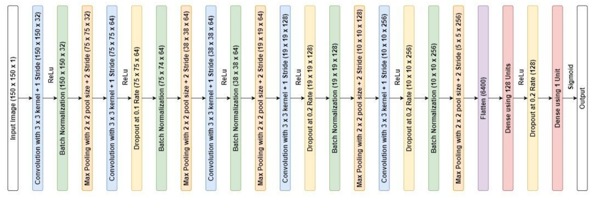
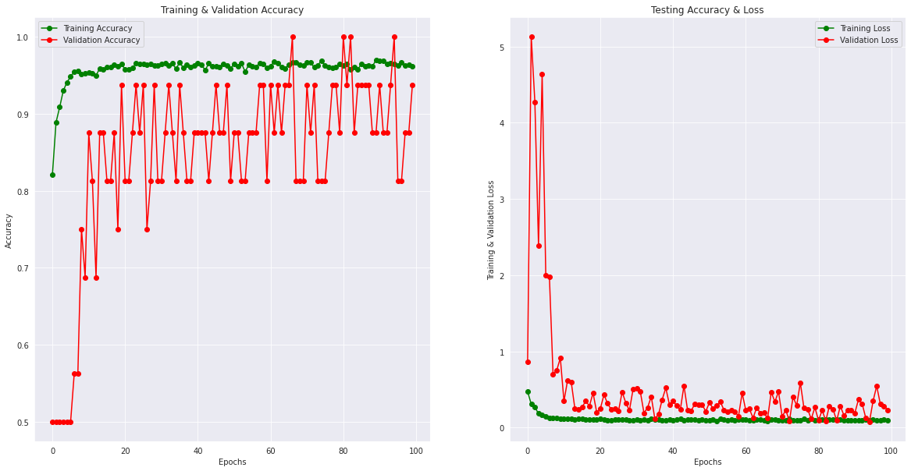
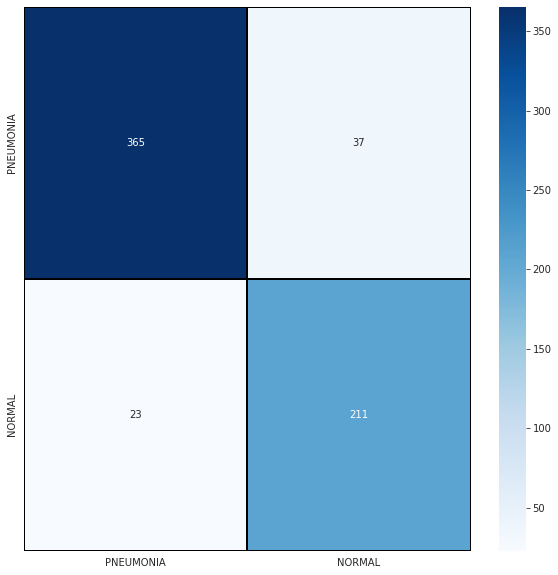

# Pneumonia Detection using CNN

The primary goal of this project was to develop and rigorously evaluate a Convolutional Neural Network (CNN) model for the accurate binary classification of pneumonia in chest X-ray imagery. This involved achieving high performance through the design and implementation of a custom CNN architecture, the application of data augmentation techniques, and a comparative analysis against established transfer learning models, specifically ResNet-50 and InceptionV3.

## How to Use

This repository contains the following resources:

* **Report.pdf:** A detailed report documenting the project methodology, results, and analysis.
* **Presentation.pdf:** A presentation summarizing the key aspects of the project.
* **codes/**: This folder contains the Jupyter Notebooks used in the project:
    * `ResNet50.ipynb`: Notebook detailing the implementation and evaluation using the ResNet-50 model.
    * `InceptionV3.ipynb`: Notebook detailing the implementation and evaluation using the InceptionV3 model.
    * `Pneumonia_Detection_using_CNN.ipynb`: The main notebook containing the implementation and evaluation of the custom CNN model for pneumonia detection, which represents the final output of this project.

To understand the project and its findings, you can start by reviewing the `Report.pdf` and `Presentation.pdf`.

To explore the code and reproduce the results:

1.  Navigate to the `codes/` directory.
2.  Open and run the Jupyter Notebook `pneumonia_detection_using_CNN.ipynb` to see the implementation and results of the final custom CNN model.
3.  You can also explore `transfer_learning_resnet50.ipynb` and `transfer_learning_inception_net.ipynb` to see the implementations and results of the transfer learning experiments.

Ensure you have the necessary Python libraries installed (e.g., TensorFlow, OpenCV, scikit-learn, matplotlib) to run the notebooks. You can typically install these using pip:

```bash
pip install tensorflow opencv-python scikit-learn matplotlib jupyter
```

## Dataset


*(Normal Chest X-ray Sample)*


*(Pneumonia Chest X-ray Sample)*

This project utilized a dataset of 3000 chest X-ray images from the Guangzhou Women and Children's Medical Center, available on Mendeley Data: [Chest X-Ray Images (Pneumonia)](https://data.mendeley.com/datasets/rscbjbr9sj/2).

The dataset is balanced, containing an equal number of pneumonia and non-pneumonia samples (1349 of each). Data augmentation was performed using TensorFlow's `ImageDataGenerator` to enhance the training process and improve the model's generalization.

The dataset was split into the following subsets:

| Set        | Number of Images |
|------------|------------------|
| Training   | 2698             |
| Validation | 16               |
| Testing    | 636              |

## Libraries

NumPy, Pandas, Matplotlib, Seaborn, Tensorflow, Keras, Scikit-Learn, OpenCV-Python


## Training

The custom Convolutional Neural Network (CNN) model was trained using the following parameters:

* **Number of Epochs:** 100
* **Loss Function:** Binary Cross-entropy
* **Batch Size:** 32
* **Callbacks:** ReduceLROnPlateau

[If you have an image of the model architecture, you can include it here:]

*(Model Architecture)*

The training and validation performance over the epochs can be visualized in the following curve:


*(Training and Validation Curve)*

This curve illustrates the training and validation accuracy and loss as the training progressed.

## Testing

   || precision | recall | f1-score | support |
   |--|--|--|--|--|
   | Pneumonia (Class 0) | 0.94 | 0.91 | 0.92 | 402 |
   | Normal (Class 1) | 0.85 | 0.90 | 0.88 | 234 |
   | accuracy ||| 0.91 | 636 |
   | macro avg | 0.90 | 0.90 | 0.90 | 636 |
   | weighted avg | 0.91 | 0.91 | 0.91 | 636 |
   
*(Classification Report)*



*(Confusion Matrix (Model Testing))*

## Results

The custom CNN model demonstrated strong performance in detecting pneumonia from chest X-ray images, achieving 91% accuracy. The model showed high precision (0.94 for Pneumonia, 0.85 for Normal) and recall (0.91 for Pneumonia, 0.90 for Normal).

## Learning
Through this project, I gained valuable experience and knowledge in the following areas:
* Deep Learning for Medical Image Analysis: I developed a deeper understanding of how Convolutional Neural Networks (CNNs) can be applied to medical image analysis, specifically for pneumonia detection in chest X-rays.
* CNN Model Development: I learned how to design, implement, and train a custom CNN architecture using TensorFlow.
* Performance Optimization: I gained practical skills in optimizing model performance, including techniques for achieving high accuracy, precision, and recall.
* Model Evaluation: I learned how to effectively evaluate model performance using metrics like precision, recall, and accuracy, and how to interpret these metrics in the context of a medical diagnosis task.
* Transfer Learning: I gained experience in comparing the performance of different transfer learning models (ResNet-50 and InceptionV3) for this specific application.
